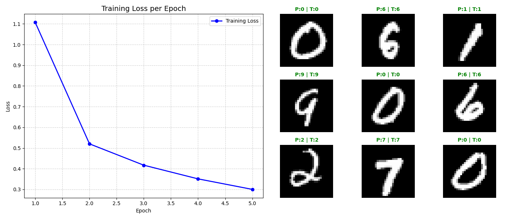

# miniFlow

[](https://www.python.org/)
[](https://numpy.org/)
[](https://opensource.org/licenses/MIT)
[](results.png)
[](miniflow/model/model.py)

**miniFlow** is a modular, high-performance deep learning library built entirely **from scratch** using **NumPy**.

Designed with an API inspired by Keras and TensorFlow, this project aims to demystify the "black box" of deep learning. It demonstrates how neural networks operate at the lowest level—handling matrix calculus, gradient descent, and backpropagation manually without relying on auto-differentiation engines.

---

## 🚀 Key Features

*   **Pure NumPy Core:** No pre-built Autograd. Every forward and backward pass is mathematically implemented using matrix operations.
*   **Keras-Style API:** Intuitive model construction using `model.add()`, `compile()`, and `fit()`.
*   **Advanced Optimizers:** Full implementation of **Adam** (Adaptive Moment Estimation) with bias correction, alongside standard SGD.
*   **Smart Initialization:** Automatic weight initialization support for **He** (for ReLU) and **Xavier/Glorot** (for Sigmoid/Tanh).
*   **Modular Architecture:** Clean separation of Layers, Losses, Activations, and Optimizers for easy extensibility.

---

## 🧠 Under the Hood: The Computational Graph

Unlike simple script-based implementations, **miniFlow** treats neural networks as a **Dynamic Computational Graph**.

Each operation (Input, Matrix Multiplication, Activation, Loss) is a **Node** in the graph. To execute the forward and backward passes correctly, the engine must determine the precise order of operations.

### Topological Sort
The heart of `miniFlow` is the implementation of **Topological Sort** (using Kahn's Algorithm / DFS). This algorithm:
1.  Analyzes the dependency between nodes.
2.  Flattens the graph into a linear sequence.
3.  Ensures that a node's value is computed only **after** all its inputs are ready.

This architecture allows for defining complex, non-linear network topologies dynamically, similar to how TensorFlow v1 operated.

---

## 📦 Installation

Since **miniFlow** relies purely on NumPy, installation is lightweight.

1. Clone the repository:
```bash
   git clone https://github.com/alitkbbl/miniFlow.git
   cd miniFlow
   ```
2. Install dependencies:
```bash
   pip install numpy matplotlib
   ```

---

## 📂 Project Structure

```text
miniflow/
├── activations/          # ReLU, LeakyReLU, Sigmoid, Tanh, Softmax
├── layers/               # Dense, Flatten, Dropout, BatchNorm
├── losses/               # SoftmaxCrossEntropy, MSE, BinaryCrossEntropy
├── optimizers/           # Adam, SGD
├── utils/                # Batch generation and data utilities
├── model/                # Core Engine (Graph execution & Training loop)
├── mnist.npz             # MNIST dataset (training/testing images and labels)
└── main.py               # Example usage (MNIST Training)
```

---

## ⚡ Quick Start

Building a neural network is simple and familiar. Below is an example of creating a Multi-Layer Perceptron (MLP) for image classification.
```python
import numpy as np
from miniflow.model import Model
from miniflow.layers import Dense, Flatten
from miniflow.activations import ReLU
from miniflow.losses import SoftmaxCrossEntropy
from miniflow.optimizers import Adam


# 1. Initialize Model and test data
model = Model()
x_train = np.random.randn(1000, 28, 28) 
y_train = np.random.randint(0, 10, size=(1000,))
y_train_encoded = np.eye(10)[y_train] 

# 2. Build Architecture (Input -> Hidden -> Output)
model.add(Flatten(input_shape=(28, 28)))      # Flatten 28x28 images
model.add(Dense(128, kernel_initializer='he')) # Hidden Layer 1
model.add(ReLU())
model.add(Dense(64, kernel_initializer='he'))  # Hidden Layer 2
model.add(ReLU())
model.add(Dense(10))                           # Output Layer (10 classes)

# 3. Compile
model.compile(optimizer=Adam(learning_rate=0.001), 
              loss=SoftmaxCrossEntropy())

# 4. Train
history = model.fit(x_train, y_train_encoded, epochs=5, batch_size=64)
```

---

## 📊 Performance & Results

We evaluated **miniFlow** on the standard **MNIST dataset** (60,000 training images, 10,000 test images). The results demonstrate high numerical stability and rapid convergence, comparable to industrial frameworks for this task.

*   **High Accuracy:** Using a simple MLP architecture (Flatten -> Dense -> ReLU), the model achieved a **94.92% accuracy** on the unseen test set in just **5 epochs**.
*   **Rapid Convergence:** Thanks to the precise implementation of the **Adam** optimizer, the training loss dropped significantly from `1.07` (Epoch 1) to `0.25` (Epoch 5).
*   **Efficiency:** The model, containing **109,386 parameters**, trains efficiently using vectorized NumPy operations.

### Visualization
The visualization below displays the training loss curve and sample predictions from the test set. Green labels indicate correct predictions, while red indicates a mismatch.



---

## 🛠️ Supported Modules

### Layers (`miniflow.layers`)
*   **Dense:** Fully connected layer with automatic weight initialization.
*   **Flatten:** Reshapes input tensors for dense processing.
*   **Dropout:** Randomly zeroes elements to prevent overfitting.
*   **BatchNorm:** Normalizes layer inputs for faster training.

### Activations (`miniflow.activations`)
*   **ReLU & LeakyReLU:** Standard for hidden layers.
*   **Tanh & Sigmoid:** For specific non-linear requirements.
*   **Softmax:** Integrated for multi-class probability distribution.

### Optimizers (`miniflow.optimizers`)
*   **Adam:** Implements momentum ($m_t$) and RMSProp ($v_t$) with bias correction.
*   **SGD:** Stochastic Gradient Descent.

### Losses (`miniflow.losses`)
*   **SoftmaxCrossEntropy:** Includes numerical stability clipping (`1e-15`) to prevent `log(0)` errors.
*   **BinaryCrossEntropy:** For binary classification tasks.
*   **MSE:** Mean Squared Error for regression.

---

## 🔮 Roadmap: From MLP to Computer Vision

While `miniFlow` currently masters Multi-Layer Perceptrons (MLPs), the next major milestone is to evolve it into a full-fledged **Computer Vision Framework**.

The goal is to move beyond Flattening images and instead preserve spatial hierarchies, aiming for **>99% accuracy** on MNIST and supporting complex datasets like CIFAR-10.

**Upcoming Features:**
*   **Convolutional Layers (Conv2D):** Implementing forward and backward passes using **`im2col`** vectorization for efficient kernel operations purely in NumPy.
*   **Pooling Layers:** Adding `MaxPooling2D` and `AveragePooling2D` for down-sampling.
*   **Advanced Architectures:** Enabling construction of deep CNNs (like LeNet or miniature VGG styles) directly within `miniFlow`.

---

### 📝 License
This project is open-source and intended for educational purposes to demonstrate the internal mechanics of Deep Learning frameworks.
